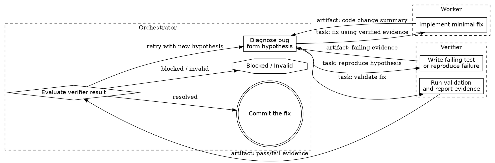

# Bug Fix Loop Design

## Summary

This design defines a strict test-driven bug-fix loop coordinated by a single orchestrator. The orchestrator is the only stateful actor and the only component aware that multiple subagents exist. It diagnoses the bug, delegates narrowly scoped work to isolated verifier and worker agents, evaluates returned artifacts, and either iterates on a new hypothesis or commits the fix.

The design is optimized for two goals:

1. Strict TDD discipline
2. Strong agent isolation

## Goals

- Require failing evidence before implementation begins
- Keep verifier and worker isolated from each other
- Centralize loop state and control in the orchestrator
- Preserve artifacts from each step for traceability
- Prevent blind retries through explicit hypothesis updates
- Allow successful fixes to be committed only after verification

## Non-Goals

- Building a general multi-agent workflow engine
- Allowing peer-to-peer communication between subagents
- Supporting unbounded retries
- Replacing human judgment for ambiguous product behavior

## Roles

### Orchestrator

The orchestrator is the sole coordinator and the only actor with awareness of the full loop. It owns:

- the bug statement
- the current root-cause hypothesis
- iteration count
- status transitions
- subagent task routing
- artifact history
- pass/fail decisions
- commit authority

The orchestrator never relies on direct subagent-to-subagent communication. All outputs return to the orchestrator, which decides what context to forward.

### Verifier

The verifier is a stateless specialist used only through orchestrator-issued tasks. It may:

- encode a hypothesis as a failing test
- reproduce the bug
- run relevant validation commands
- summarize failure or success evidence

The verifier does not know about the worker and does not decide what happens next.

### Worker

The worker is a stateless specialist used only through orchestrator-issued tasks. It may:

- implement a minimal fix
- update code necessary to satisfy the failing test
- summarize changed files and assumptions

The worker does not know about the verifier and does not decide whether the bug is fixed.

## Core Architecture

The loop is orchestrator-mediated, not a linear subagent handoff pipeline. The orchestrator acts as a hub:

1. Diagnose the bug and form a hypothesis
2. Ask the verifier to encode that hypothesis as a failing test or failure reproduction
3. Review the verifier artifact and instruct the worker to implement the minimal fix
4. Ask the verifier to run validation on the updated code
5. Decide whether the bug is resolved, blocked, or needs another iteration
6. Commit only after successful verification

## Loop State

The orchestrator maintains a private per-bug state object with fields like:

- `bug_report`: plain-language description of the bug
- `hypothesis`: current explanation of root cause
- `iteration`: current loop attempt number
- `status`: `diagnosing | reproducing | fixing | validating | resolved | blocked | invalid`
- `failing_test_artifact`: verifier-produced repro or test artifact
- `failure_evidence`: proof that the bug is currently reproducible
- `fix_artifact`: worker summary of implementation changes
- `validation_artifact`: verifier-produced post-fix validation results
- `history`: prior hypotheses, instructions, and outcomes

This state belongs exclusively to the orchestrator. Subagents only receive the minimum required subset for their task.

## Workflow

### 1. Diagnose

The orchestrator inspects the bug report and any prior evidence, then forms a root-cause hypothesis.

Expected output:

- a concrete hypothesis
- target area or files if known
- a reproduction goal for the verifier

### 2. Reproduce

The orchestrator asks the verifier to turn the hypothesis into failing evidence.

Expected verifier artifact:

- test added or updated, or explicit reproduction procedure
- exact command run
- failure output
- explanation of how the failure matches the reported bug

If the verifier cannot reproduce the issue, the orchestrator must either refine the hypothesis or terminate as blocked.

### 3. Fix

The orchestrator asks the worker to make the minimal code change needed to satisfy the failing evidence.

Expected worker artifact:

- files changed
- implementation summary
- assumptions and risks
- unresolved uncertainty, if any

### 4. Validate

The orchestrator asks the verifier to run the relevant test and validation commands after the fix.

Expected verifier artifact:

- commands run
- pass/fail result
- evidence that the original failure is resolved or still present
- any newly surfaced regression

### 5. Decide

The orchestrator evaluates the validation artifact and chooses one of three outcomes:

- `resolved`: relevant tests pass and the bug appears fixed
- `blocked`: progress cannot continue with current evidence or iteration budget
- `retry`: a new iteration is needed with a refined hypothesis or narrower instructions

## Retry Policy

Retries are allowed, but only when justified by new evidence or a refined understanding of the bug.

### Valid retry triggers

- the reproduced failure only partially matches the bug report
- the worker fixed the wrong root cause
- validation reveals a clearer failure mode
- the previous instructions were underspecified

### Retry requirements

Before a new iteration, the orchestrator must update at least one of:

- the root-cause hypothesis
- the reproduction strategy
- the worker instructions
- the validation scope

Blind retries are forbidden.

### Retry limit

Use a bounded iteration count, such as `max_iterations = 3` by default. If the loop exceeds that budget without resolution, the orchestrator should stop and return a blocked result with a summary of attempted hypotheses and evidence.

## Termination Conditions

### Success

Terminate successfully only when all of the following are true:

- the verifier demonstrated an initial failing condition
- the worker implemented a fix
- the verifier confirmed the relevant tests now pass
- the orchestrator concludes the bug is resolved
- the fix is committed

### Blocked

Terminate as blocked when:

- the verifier cannot reproduce the bug after reasonable attempts
- the retry limit is reached
- the fix introduces unresolved regressions
- the available evidence is too weak to form a credible next hypothesis

### Invalid

Terminate as invalid when:

- the report is not actually a bug
- the expected behavior is too ambiguous to verify
- required environment dependencies are unavailable

## Invariants

The loop must enforce the following invariants:

1. Only the orchestrator knows multiple agents exist
2. All subagent outputs return to the orchestrator
3. No implementation starts without failing evidence
4. No commit happens without post-fix verification
5. Every retry changes the hypothesis or instruction set
6. Step artifacts are preserved for traceability and auditability

## Artifact Contracts

Artifacts are the interface between orchestrator decisions and subagent work.

### Verifier artifact

Should contain:

- failing test or reproduction description
- command executed
- observed output
- mapping between evidence and reported bug
- confidence or caveats if reproduction is partial

### Worker artifact

Should contain:

- changed files
- implementation summary
- assumptions
- residual risk or uncertainty

The orchestrator may redact or compress these artifacts before forwarding context, but subagents should never receive raw peer-to-peer outputs directly.

## Revised Graph

## Rationale

This design preserves strict TDD by requiring failure before implementation and verification before commit. It also preserves strong agent isolation by ensuring that verifier and worker only interact with the orchestrator, never with each other. That keeps responsibilities narrow, makes the loop auditable, and prevents subagent coordination complexity from leaking into task execution.
