# Resolve PR Comments — Design

**Date:** 2026-04-22
**Status:** Draft

## Overview

A Claude Code plugin that batch-resolves unresolved PR review comments. It fetches all unresolved threads from a GitHub PR, deduplicates logically identical comments, parallelizes fixes via dedicated subagents, verifies each fix before committing, and resolves the GitHub threads once pushed.

Packaged as a Claude Code plugin so it can be installed across any repo via `claude plugin install` or tested locally with `--plugin-dir`.

## Flow

This mermaid flowchart goes at the top of the SKILL.md so the orchestrator immediately sees the full workflow:

```mermaid
flowchart LR
    Start(["Start"]) --> DetectPR["Detect PR\n(branch or user input)"]
    DetectPR --> DirtyCheck{"Working tree\nclean?"}
    DirtyCheck -- No --> Abort(["Abort"])
    DirtyCheck -- Yes --> Fetch["Fetch unresolved\nreview threads\n(gh GraphQL API)"]
    Fetch --> Dedupe["Dedupe logically\nidentical comments"]
    Dedupe --> Conflicts{"Any comments\nconflict?"}
    Conflicts -- Yes --> AskUser["Flag conflicts,\nask user to resolve"]
    AskUser --> GenVerify
    Conflicts -- No --> GenVerify["Generate verification\nsteps for each comment"]
    GenVerify --> WriteJSON["Write\n/tmp/pr-number/comments.json"]
    WriteJSON --> Parallelize["Group comments:\nparallel (different files)\nvs serial (same files)"]
    Parallelize --> DispatchFixer["Dispatch\npr-comment-fixer\nsubagent(s)"]
    DispatchFixer --> DispatchVerifier["Dispatch\npr-comment-verifier\nsubagent"]
    DispatchVerifier --> Verified{"Fix verified?"}
    Verified -- Yes --> Commit["Verifier commits fix"]
    Commit --> UpdateJSON["Update comments.json\naddressed + isVerified"]
    UpdateJSON --> MoreComments{"More unresolved\ncomments?"}
    MoreComments -- Yes --> DispatchFixer
    MoreComments -- No --> Push["git push\n(all commits at once)"]
    Verified -- No --> RetryFixer["Dispatch new fixer\nwith verifier feedback"]
    RetryFixer --> DispatchVerifier
    Push --> ResolveThreads["Resolve each GitHub\nthread via GraphQL\nresolveReviewThread mutation"]
    ResolveThreads --> Done(["Done"])
```



## Goals

- **One-shot backlog clear:** Run once to address all outstanding review comments on a PR
- **Idempotent:** Re-running fetches fresh unresolved threads; already-resolved threads are skipped
- **Parallel where safe:** Comments touching different files are fixed concurrently
- **Verified before committed:** Every fix is validated by an isolated verifier agent before it's committed
- **Clean history:** One commit per resolved comment, all pushed at the end
- **Portable:** Installable as a Claude Code plugin across any repo

## Plugin Structure

```
comment-fixer/
├── .claude-plugin/
│   └── plugin.json              # Plugin manifest
├── skills/
│   └── resolve-pr-comments/
│       └── SKILL.md             # Main orchestration skill
├── agents/
│   ├── pr-comment-fixer.md      # Fixer subagent
│   └── pr-comment-verifier.md   # Verifier subagent
├── docs/
│   ├── designs/                 # Design docs
│   └── specs/                   # Implementation plans
└── README.md
```

## Plugin Manifest

`.claude-plugin/plugin.json`:

```json
{
  "name": "comment-fixer",
  "description": "Batch-resolve unresolved PR review comments with parallel fix/verify subagents",
  "version": "1.0.0",
  "author": {
    "name": "Harris"
  }
}
```

Skill invocation: `/comment-fixer:resolve-pr-comments` (or auto-invoked by Claude based on task context).

## Data Model

Single file: `/tmp/<pr-number>/comments.json`

```json
[
  {
    "id": 1,
    "text": "This function should handle null input",
    "githubLinks": [
      "https://github.com/org/repo/pull/2451#discussion_r1234567",
      "https://github.com/org/repo/pull/2451#discussion_r1234890"
    ],
    "threadIds": ["PRRT_abc123", "PRRT_def456"],
    "addressed": false,
    "verificationSteps": "Ensure the function gracefully handles null/undefined input without throwing. The existing tests should still pass, and there should be coverage for the null case.",
    "isVerified": false
  }
]
```

### Fields

- **id**: Sequential integer, assigned during generation
- **text**: The review comment text (or merged text if multiple reviewers said the same thing)
- **githubLinks**: URLs back to the original GitHub comment(s). Multiple links when logically duplicate comments from different reviewers are merged
- **threadIds**: GitHub GraphQL node IDs for the review threads (e.g., `PRRT_xxx`). Required for the `resolveReviewThread` mutation in the final step. Captured during the fetch step.
- **addressed**: Set to `true` after the fixer agent completes its work
- **verificationSteps**: Freeform markdown describing *what* needs to be true for the fix to be correct. The verifier agent decides *how* to check (which commands, which tests, etc.)
- **isVerified**: Set to `true` by the verifier agent after successful validation and commit

### Deduplication Rules

Only merge comments that are **logically the same** — i.e., different reviewers asking for the same change. Comments on the same file/line but about different issues remain separate entries. The orchestrator uses AI judgment to identify logical duplicates.

## Orchestration Flow

### Step 1: Fetch & Dedupe

1. Auto-detect PR from current branch (user can override with PR number/URL)
2. Check for uncommitted changes — abort if working tree is dirty
3. Fetch all unresolved review threads via GitHub GraphQL API:
   ```bash
   gh api graphql  # query pullRequest.reviewThreads where isResolved=false
   ```
4. Deduplicate logically identical comments across reviewers
5. Generate `verificationSteps` for each entry (AI-generated, conceptual)
6. If any comments logically conflict, flag them and ask the user to resolve before proceeding
7. Write `/tmp/<pr-number>/comments.json`

### Step 2: Parallel Fix Dispatch

1. Analyze `comments.json` to determine which comments can be fixed in parallel (no overlapping files) vs. which must be serialized (same files)
2. Dispatch `pr-comment-fixer` subagents via the Agent tool, parallelizing where safe
3. Each fixer receives: the comment text, verification criteria, and (on retries) prior verifier feedback
4. Fixers implement changes but do NOT commit
5. For same-file comments: wait for the full fix → verify → commit cycle of one comment to complete before dispatching the fixer for the next comment on that file (since the verifier commits, the next fixer needs the committed state)

### Step 3: Verify & Commit

1. After each fixer completes, dispatch `pr-comment-verifier` subagent
2. Verifier inspects uncommitted changes, runs whatever checks it deems appropriate based on the verification steps
3. **If verified:** Verifier commits with message `fix: address review comment — <brief description>` and reports success. The orchestrator then updates `comments.json` (`addressed: true`, `isVerified: true`).
4. **If not verified:** Verifier reports what failed. Orchestrator dispatches a new fixer with the verifier's feedback appended. No retry limit — continues until user intervenes.

### Step 4: Push

After all comments are addressed (or remaining ones are blocked waiting for user), push all commits at once:
```bash
git push
```

### Step 5: Resolve GitHub Threads

For each verified entry in `comments.json`, resolve all associated GitHub threads using the GraphQL mutation:

```graphql
mutation {
  resolveReviewThread(input: { threadId: "PRRT_xxx" }) {
    thread { isResolved }
  }
}
```

**This is specifically the "resolve conversation" action in GitHub — marking the thread as resolved/collapsed. Not posting a comment. Not reacting. Not replying. The `resolveReviewThread` mutation only. No fallback to commenting is allowed.**

## Agent Design

### `pr-comment-fixer`

Plugin subagent at `agents/pr-comment-fixer.md`.

**Purpose:** Fix a single PR review comment. Reads the codebase, understands the issue, implements the minimal fix. Does not commit.

**Frontmatter:**
```yaml
---
name: pr-comment-fixer
description: Fix a single PR review comment. Reads the codebase, understands the issue, implements the minimal fix. Does not commit.
model: inherit
---
```

The agent inherits all tools (needs Read, Edit, Write, Grep, Glob, Bash for implementing fixes).

**Input (via task prompt):**
- Review comment text
- Verification criteria
- Optional: prior verifier feedback (on retries)

**Output:** Summary of what was changed and why. Changes left uncommitted in the working tree.

### `pr-comment-verifier`

Plugin subagent at `agents/pr-comment-verifier.md`.

**Purpose:** Verify a fix is correct using the provided verification criteria. Commits if verified.

**Frontmatter:**
```yaml
---
name: pr-comment-verifier
description: Verify a PR comment fix is correct using the provided verification criteria. Commits if verified.
model: inherit
---
```

The agent inherits all tools (needs Read, Grep, Glob, Bash for validation, plus Write for committing via git).

**Input (via task prompt):**
- Original review comment text
- Verification criteria (conceptual markdown)
- Summary of what the fixer changed

**Behavior:**
- Inspects uncommitted changes
- Runs tests, type checks, or other validation as it sees fit
- If verified: commits the changes, reports success
- If not verified: does NOT commit, reports exactly what failed

### Plugin Agent Constraints

Per the Claude Code plugin spec, plugin-shipped agents **cannot** use `hooks`, `mcpServers`, or `permissionMode` frontmatter fields. These are security restrictions. This is fine for our use case — both agents only need standard tools.

## Conflict Handling

When two comments logically conflict (e.g., Reviewer A wants approach X, Reviewer B wants approach Y for the same code), the orchestrator:
1. Flags the conflict in its output
2. Asks the user to pick a direction
3. Only proceeds with the user's chosen resolution

This happens before any fixer dispatch.

## Git Safety

- Works only on the PR head branch
- Aborts if working tree is dirty at startup
- Each verified fix gets its own commit
- All commits pushed at the end in one push
- No force pushes
- No branch switching

## Idempotency

The workflow is idempotent because:
1. It always fetches **fresh** unresolved threads from GitHub at startup
2. Already-resolved threads don't appear in the fetch
3. If `/tmp/<pr-number>/comments.json` exists from a prior run, it's replaced with the fresh fetch
4. Thread resolution happens via mutation only after push succeeds

Re-running the skill after a partial completion picks up only the remaining unresolved comments.

## Installation

### Local development
```bash
claude --plugin-dir ./comment-fixer
```

### User-scope install (from marketplace or local)
```bash
claude plugin install comment-fixer@<marketplace>
```

### Usage
```
/comment-fixer:resolve-pr-comments
```
Or Claude auto-invokes based on task context (e.g., "resolve all PR comments").
