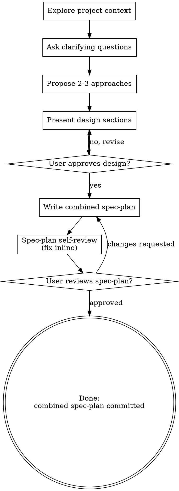

# Brainstorming Ideas Into Designs

Help turn ideas into fully formed design-and-plan specs through natural collaborative dialogue.

Start by understanding the current project context, then ask questions one at a time to refine the idea. Once you understand what you're building, present the design and get user approval.

<HARD-GATE>
Do NOT invoke any implementation skill, write any code, scaffold any project, or take any implementation action until you have presented a design and the user has approved it. This applies to EVERY project regardless of perceived simplicity.
</HARD-GATE>

## Anti-Pattern: "This Is Too Simple To Need A Design"

Every project goes through this process. A todo list, a single-function utility, a config change — all of them. "Simple" projects are where unexamined assumptions cause the most wasted work. The design can be short (a few sentences for truly simple projects), but you MUST present it and get approval.

## Checklist

You MUST create a todo list for these items and complete them in order:

1. **Explore project context** — check files, docs, recent commits
2. **Ask clarifying questions** — one at a time, understand purpose/constraints/success criteria
4. **Propose 2-3 approaches** — with trade-offs and your recommendation
5. **Present design** — in sections scaled to their complexity, get user approval after each section
6. **Write combined spec-plan** — save to `docs/specs/YYYY-MM-DD-<topic>.md` and commit
7. **Spec-plan self-review** — quick inline check for placeholders, contradictions, ambiguity, scope (see below)
8. **User reviews written spec-plan** — ask user to review the combined spec-plan file before considering brainstorming complete

## Process Flow

**The terminal state is having one combined spec-plan written, reviewed, and committed.** Do NOT start implementing. Brainstorming is done when that artifact exists.

## The Process

**Understanding the idea:**

- Check out the current project state first (files, docs, recent commits)
- Before asking detailed questions, assess scope: if the request describes multiple independent subsystems (e.g., "build a platform with chat, file storage, billing, and analytics"), flag this immediately. Don't spend questions refining details of a project that needs to be decomposed first.
- If the project is too large for a single spec-plan, help the user decompose into sub-projects: what are the independent pieces, how do they relate, what order should they be built? Then brainstorm the first sub-project through the normal design flow. Each sub-project gets its own combined spec-plan → implementation cycle.
- For appropriately-scoped projects, ask questions one at a time to refine the idea
- Prefer multiple choice questions when possible, but open-ended is fine too
- Only one question per message - if a topic needs more exploration, break it into multiple questions
- Focus on understanding: purpose, constraints, success criteria

**Exploring approaches:**

- Propose 2-3 different approaches with trade-offs
- Present options conversationally with your recommendation and reasoning
- Lead with your recommended option and explain why

**Presenting the design:**

- Once you believe you understand what you're building, present the design
- Scale each section to its complexity: a few sentences if straightforward, up to 200-300 words if nuanced
- Ask after each section whether it looks right so far
- Cover: architecture, components, data flow, error handling, testing
- Be ready to go back and clarify if something doesn't make sense

**Design for isolation and clarity:**

- Break the system into smaller units that each have one clear purpose, communicate through well-defined interfaces, and can be understood and tested independently
- For each unit, you should be able to answer: what does it do, how do you use it, and what does it depend on?
- Can someone understand what a unit does without reading its internals? Can you change the internals without breaking consumers? If not, the boundaries need work.
- Smaller, well-bounded units are also easier for you to work with - you reason better about code you can hold in context at once, and your edits are more reliable when files are focused. When a file grows large, that's often a signal that it's doing too much.

**Working in existing codebases:**

- Explore the current structure before proposing changes. Follow existing patterns.
- Where existing code has problems that affect the work (e.g., a file that's grown too large, unclear boundaries, tangled responsibilities), include targeted improvements as part of the design - the way a good developer improves code they're working in.
- Don't propose unrelated refactoring. Stay focused on what serves the current goal.

## After the Design

**Documentation:**

- Write the validated design and step-by-step implementation plan to one combined spec-plan at `docs/specs/YYYY-MM-DD-<topic>.md`
  - (User preferences for spec-plan location override this default)
- Commit the combined spec-plan document to git

The combined spec-plan should include:

1. Purpose and goals
2. Scope and non-goals
3. Requirements and constraints
4. Selected design
5. Alternatives considered
6. Architecture, components, and data flow where relevant
7. Error handling and edge cases where relevant
8. Testing and validation strategy
9. Step-by-step implementation plan
10. Acceptance criteria

Sections may be concise for small changes, but the file should still be complete enough to guide implementation without another planning artifact.

**Spec-Plan Self-Review:**
After writing the combined spec-plan document, look at it with fresh eyes:

1. **Placeholder scan:** Any "TBD", "TODO", incomplete sections, or vague requirements? Fix them.
2. **Internal consistency:** Do any sections contradict each other? Does the design match the implementation plan?
3. **Scope check:** Is this focused enough for a single combined spec-plan, or does it need decomposition?
4. **Ambiguity check:** Could any requirement be interpreted two different ways? If so, pick one and make it explicit.

Fix any issues inline. No need to re-review — just fix and move on.

**User Review Gate:**
After the self-review loop passes, ask the user to review the written combined spec-plan before considering brainstorming complete:

> "Combined spec-plan written and committed to `<path>`. Please review it and let me know if you want to make any changes."

Wait for the user's response. If they request changes, make them in the same file and re-run the self-review loop. Do not create a second implementation plan document as a fallback.

**Terminal State:**

- Brainstorming is complete once the combined spec-plan is written, reviewed, and committed
- Do not start implementation during brainstorming unless the user explicitly leaves the brainstorming flow and asks for implementation after approving the committed combined spec-plan

## Key Principles

- **One question at a time** - Don't overwhelm with multiple questions
- **Multiple choice preferred** - Easier to answer than open-ended when possible
- **YAGNI ruthlessly** - Remove unnecessary features from all designs
- **Explore alternatives** - Always propose 2-3 approaches before settling
- **Incremental validation** - Present design, get approval before moving on
- **Be flexible** - Go back and clarify when something doesn't make sense
