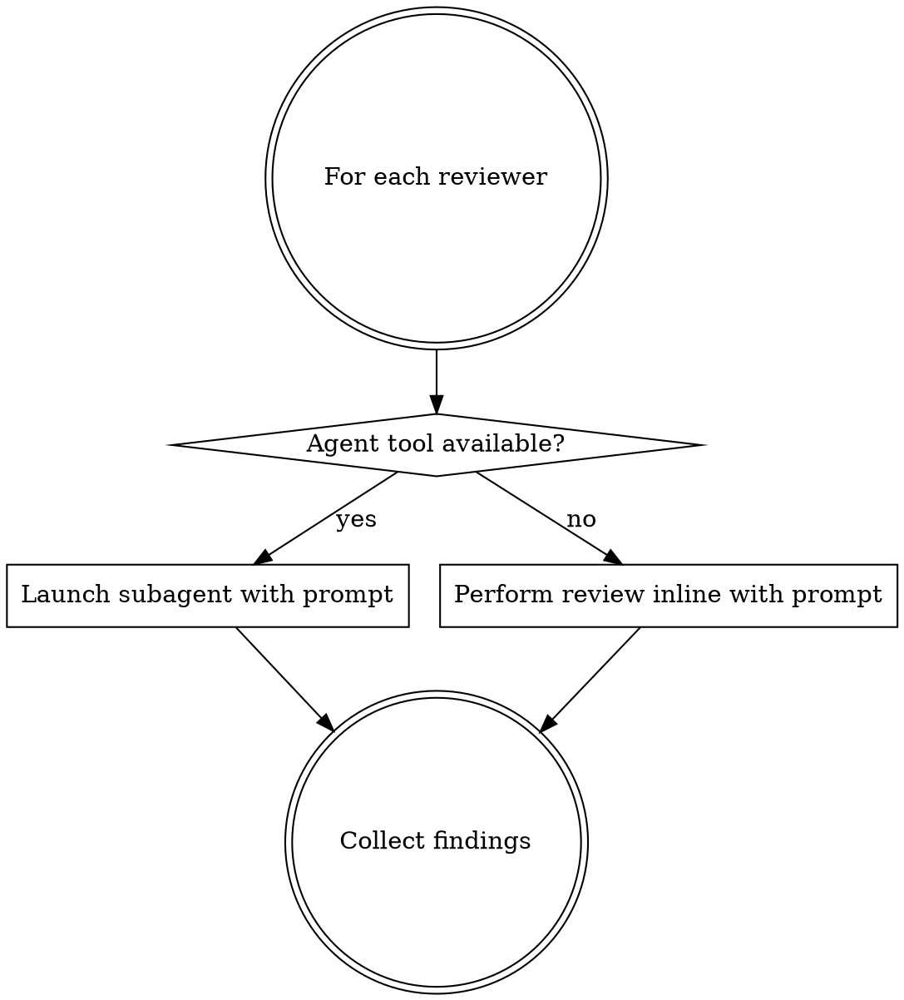

# Diff-Scoped Code Review

Multi-pass code review using specialized reviewers that **only flag issues on changed lines**. Each reviewer analyzes a different dimension of code quality. False positives are minimized by scoping every finding to `+` lines in the diff.

## Step 1: Determine Review Aspects

Parse the user's request to determine which review aspects to run and the execution mode.

### Aspect Keywords

| Keyword    | Reviewer                | Description                      |
|------------|-------------------------|----------------------------------|
| `code`     | code-reviewer           | General quality, bugs, guidelines |
| `tests`    | test-analyzer           | Test coverage gaps               |
| `comments` | comment-analyzer        | Comment accuracy & value         |
| `errors`   | silent-failure-hunter   | Error handling & silent failures |
| `types`    | type-design-analyzer    | Type design & invariants         |
| `simplify` | code-simplifier         | Clarity & simplification         |
| `all`      | Auto-detect (default)   | Select reviewers based on diff   |

If no specific aspect is mentioned, treat it as `all` (auto-detect).

### Execution Mode

If the user says "parallel", run all reviewers simultaneously. Otherwise run sequentially (default).

## Step 2: Get the Diff

Run these commands to find the right diff to review.

### 2a: Check for an open PR

```bash
gh pr view --json baseRefName -q .baseRefName
```

### 2b: Get the diff

- **If a PR exists** (above command succeeded and returned a base branch): use `git diff <base>...HEAD`
- **If no PR exists** (command failed): use `git diff HEAD` for uncommitted changes. If empty, fall back to `git diff main...HEAD` for committed branch changes.

Store the full diff output — it gets passed to every reviewer.

### 2c: Get the changed file list

Run `git diff --name-only` with the same scope used above.

### 2d: Validate

If the diff is empty after all attempts, report "No changes to review" and stop.

## Step 3: Select Reviewers

### Explicit selection

If the user specified aspects, map them directly to reviewers using the table above.

### Auto-detection (when `all` or no aspect specified)

Analyze the changed files and diff content:

- **Always run**: code-reviewer
- **If any file matches `*.test.*` or `*.spec.*`**: also run test-analyzer
- **If diff contains `catch`, `try {`, `.catch(`, or `throw `**: also run silent-failure-hunter
- **If diff contains `type `, `interface `, `z.object`, `z.string`, `z.number`, `z.enum`, or `z.union`**: also run type-design-analyzer
- **If diff `+` lines contain `//`, `/*`, `**/`, or `* `**: also run comment-analyzer
- **code-simplifier** is NEVER auto-detected — only runs when explicitly requested via `simplify`

## Step 4: Run Reviewers

For each selected reviewer, read its reference prompt from the `references/` directory adjacent to this SKILL.md file. The reference files are:

| Reviewer              | Reference file                         |
|-----------------------|----------------------------------------|
| code-reviewer         | `references/code-reviewer.md`          |
| test-analyzer         | `references/test-analyzer.md`          |
| comment-analyzer      | `references/comment-analyzer.md`       |
| silent-failure-hunter | `references/silent-failure-hunter.md`  |
| type-design-analyzer  | `references/type-design-analyzer.md`   |
| code-simplifier       | `references/code-simplifier.md`        |

### Building the reviewer prompt

For each reviewer, construct a prompt containing:
1. The full content of the reviewer's reference file (its system instructions)
2. The line: "You are reviewing the following PR diff:"
3. The full diff output (fenced in a code block)
4. The line: "Changed files:" followed by the file list
5. The instruction: "Apply your review expertise to the changed code. Remember: only flag issues on `+` lines from the diff."

### Dispatching reviewers



**If your environment supports subagents** (e.g., Claude Code's `Agent` tool, or a `Task` tool):
- Dispatch each reviewer as a subagent, passing the constructed prompt
- In parallel mode, launch all subagents simultaneously
- In sequential mode, launch one at a time and briefly summarize findings before the next

**If your environment does NOT support subagents:**
- Read the reference file for each reviewer
- Perform the review yourself, following the reference file's instructions exactly
- In sequential mode, complete one review at a time
- Present findings as you go

## Step 5: Aggregate Results

After all reviewers complete, present a unified summary:

```markdown
# Code Review Summary

## Critical Issues (must fix)
- [reviewer-name] Issue description — `file.ts`
  > quoted diff hunk

## Important Issues (should fix)
- [reviewer-name] Issue description — `file.ts`
  > quoted diff hunk

## Suggestions (consider)
- [reviewer-name] Suggestion — `file.ts`
  > quoted diff hunk

## Strengths
- What's well-done in this PR
```

### Summary rules

- Group findings by severity across all reviewers
- Include the originating reviewer name in square brackets before each finding
- Include the relevant file path and quoted diff hunk for every finding
- If no issues found across all reviewers: "No issues found. Code looks good."
- Deduplicate: if multiple reviewers flag the same line for the same reason, report once and note which reviewers flagged it
