# Resolve PR Comments

Batch-resolve all unresolved PR review comments. Fetches threads, deduplicates, parallelizes fixes via subagents, verifies each fix, commits, pushes, and resolves GitHub threads.

```mermaid
flowchart LR
    Start(["Start"]) --> DetectPR["Detect PR\n(branch or user input)"]
    DetectPR --> DirtyCheck{"Working tree\nclean?"}
    DirtyCheck -- No --> Abort(["Abort"])
    DirtyCheck -- Yes --> Fetch["Fetch unresolved\nreview threads\n(gh GraphQL API)"]
    Fetch --> Dedupe["Dedupe logically\nidentical comments"]
    Dedupe --> Conflicts{"Any comments\nconflict?"}
    Conflicts -- Yes --> AskUser["Flag conflicts,\nask user to resolve"]
    AskUser --> GenVerify
    Conflicts -- No --> GenVerify["Generate verification\nsteps for each comment"]
    GenVerify --> WriteJSON["Write\n/tmp/pr-number/comments.json"]
    WriteJSON --> Parallelize["Group comments:\nparallel (different files)\nvs serial (same files)"]
    Parallelize --> DispatchFixer["Dispatch\npr-comment-fixer\nsubagent(s)"]
    DispatchFixer --> DispatchVerifier["Dispatch\npr-comment-verifier\nsubagent"]
    DispatchVerifier --> Verified{"Fix verified?"}
    Verified -- Yes --> Commit["Verifier commits fix"]
    Commit --> UpdateJSON["Update comments.json\naddressed + isVerified"]
    UpdateJSON --> MoreComments{"More unresolved\ncomments?"}
    MoreComments -- Yes --> DispatchFixer
    MoreComments -- No --> Push["git push\n(all commits at once)"]
    Verified -- No --> RetryFixer["Dispatch new fixer\nwith verifier feedback"]
    RetryFixer --> DispatchVerifier
    Push --> ResolveThreads["Resolve each GitHub\nthread via GraphQL\nresolveReviewThread mutation"]
    ResolveThreads --> Done(["Done"])
```



## When to Use

- User asks to resolve, fix, or address PR review comments
- User asks to clear their PR review backlog
- User mentions unresolved review threads on a PR

## Prerequisites

- `gh` CLI installed and authenticated
- On a branch with an open PR (or user provides PR number/URL)
- Clean working tree (no uncommitted changes)

## Procedure

### Step 1: Detect PR and Check Working Tree

1. Detect the PR from the current branch:
   ```bash
   gh pr view --json number,url,headRefName
   ```
   If the user provided a PR number or URL, use that instead.

2. Check for a clean working tree:
   ```bash
   git status --porcelain
   ```
   If output is non-empty, **abort immediately** with a message:
   > "Working tree is dirty. Please commit or stash your changes before running this skill."

3. Store the PR number for use in subsequent steps.

### Step 2: Fetch Unresolved Review Threads

Fetch all unresolved review threads using the GitHub GraphQL API:

```bash
gh api graphql -f query='
{
  repository(owner: "OWNER", name: "REPO") {
    pullRequest(number: PR_NUMBER) {
      reviewThreads(first: 100) {
        nodes {
          id
          isResolved
          comments(first: 10) {
            nodes {
              body
              url
              path
              line
              author {
                login
              }
            }
          }
        }
      }
    }
  }
}
'
```

Extract the owner and repo from the current git remote:
```bash
gh repo view --json owner,name
```

Filter to only threads where `isResolved` is `false`.

For each unresolved thread, extract:
- Thread ID (the `id` field u2014 this is the GraphQL node ID like `PRRT_xxx`)
- Comment body text
- Comment URL (for `githubLinks`)
- File path and line number
- Author login

### Step 3: Deduplicate and Detect Conflicts

**Deduplication:** Review all unresolved comments and identify logically identical ones u2014 different reviewers asking for the same change. Merge these into a single entry with multiple `githubLinks` and `threadIds`. Use AI judgment: only merge comments that are truly asking for the same thing, not just comments on the same file/line.

**Conflict detection:** Identify comments that logically conflict u2014 e.g., Reviewer A wants approach X and Reviewer B wants approach Y for the same code. If conflicts exist:
1. Present the conflicting comments to the user
2. Ask the user to pick a direction for each conflict
3. Only proceed after the user resolves all conflicts

### Step 4: Generate Verification Steps and Write comments.json

For each deduplicated comment, generate `verificationSteps` u2014 freeform markdown describing what must be true for the fix to be correct. These should be conceptual ("ensure null inputs are handled gracefully") not prescriptive ("run `npm test`"). The verifier decides how to check.

Write the data to `/tmp/<pr-number>/comments.json`:

```json
[
  {
    "id": 1,
    "text": "This function should handle null input",
    "githubLinks": [
      "https://github.com/org/repo/pull/123#discussion_r1234567"
    ],
    "threadIds": ["PRRT_abc123"],
    "filePath": "src/utils.ts",
    "addressed": false,
    "verificationSteps": "Ensure the function gracefully handles null/undefined input without throwing. Existing tests should still pass.",
    "isVerified": false
  }
]
```

Create the `/tmp/<pr-number>/` directory first:
```bash
mkdir -p /tmp/<pr-number>
```

### Step 5: Group and Dispatch Fixers

Analyze `comments.json` to determine parallelization:
- **Different files**: Comments touching different files can be fixed in parallel
- **Same file**: Comments on the same file must be serialized (wait for full fix u2192 verify u2192 commit cycle before dispatching the next fixer for that file)

For each comment (or parallel batch), dispatch the `pr-comment-fixer` agent using the Task tool:

**Fixer prompt template:**
```
Fix this PR review comment.

Review comment:
<comment text>

File: <file path>

Verification criteria:
<verification steps>

<if retry>
Previous fix attempt failed verification. Verifier feedback:
<verifier feedback>

Address the specific issues raised by the verifier.
</if retry>
```

Use the `pr-comment-fixer` agent (located at `agents/pr-comment-fixer.md` relative to the plugin root).

### Step 6: Verify and Commit

After each fixer completes, dispatch the `pr-comment-verifier` agent using the Task tool:

**Verifier prompt template:**
```
Verify and commit this PR comment fix.

Original review comment:
<comment text>

Verification criteria:
<verification steps>

Fixer's change summary:
<fixer output summary>
```

Use the `pr-comment-verifier` agent (located at `agents/pr-comment-verifier.md` relative to the plugin root).

**Handle verifier results:**
- **Verified (committed):** Update `comments.json` u2014 set `addressed: true` and `isVerified: true` for that entry. Proceed to the next comment.
- **Not verified:** Dispatch a new fixer with the verifier's feedback appended to the prompt. There is no retry limit u2014 continue until the fix is verified or the user intervenes.

### Step 7: Push

After all comments in `comments.json` have `addressed: true` and `isVerified: true`:

```bash
git push
```

Do NOT force push. If the push fails due to remote changes, pull and rebase first:
```bash
git pull --rebase && git push
```

### Step 8: Resolve GitHub Threads

For each verified entry in `comments.json`, resolve all associated GitHub threads using the GraphQL mutation:

```bash
gh api graphql -f query='
mutation {
  resolveReviewThread(input: { threadId: "THREAD_ID" }) {
    thread {
      isResolved
    }
  }
}
'
```

Iterate through all `threadIds` for each entry and resolve them one by one.

**IMPORTANT:** This is specifically the `resolveReviewThread` mutation u2014 marking the thread as resolved/collapsed in GitHub. Do NOT post comments, do NOT add reactions, do NOT reply to threads. The `resolveReviewThread` mutation only. No fallback to commenting is allowed.

### Step 9: Report

Output a summary:
- Total comments found
- Comments resolved (with brief descriptions)
- Comments that required retries (and how many)
- Any comments that remain unresolved (and why)
- Link to the PR

## Idempotency

This workflow is idempotent:
- It always fetches fresh unresolved threads from GitHub at startup
- Already-resolved threads don't appear in the fetch
- If `/tmp/<pr-number>/comments.json` exists from a prior run, it is replaced with the fresh fetch
- Thread resolution happens via mutation only after push succeeds
- Re-running after a partial completion picks up only the remaining unresolved comments

## Git Safety

- Works only on the PR head branch
- Aborts if working tree is dirty at startup
- Each verified fix gets its own commit
- All commits pushed at the end in one push
- No force pushes
- No branch switching

## Gotchas

- Do not proceed if the working tree is dirty. Always check first.
- Do not skip the deduplication step, even if there's only one reviewer.
- Do not merge comments that are on the same file/line but about different issues.
- Do not let fixers commit. Only verifiers commit.
- Do not push until ALL comments are addressed.
- Do not post comments or reactions on GitHub threads. Only use `resolveReviewThread`.
- For same-file comments, do not dispatch a second fixer until the first fixer's changes are verified and committed.
- If `gh api graphql` fails for thread resolution, report the error but do not fall back to any other mechanism.
